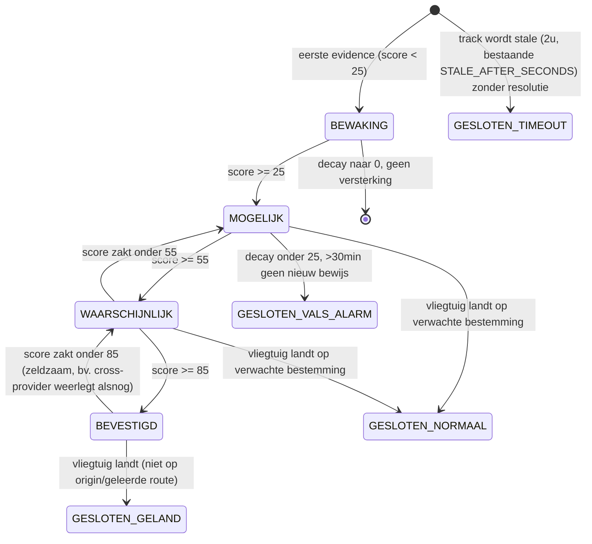

# Masterplan: van "losse meldingen" naar een levend incident-systeem

Dit document is geschreven vóór implementatie, door een Claude-sessie op hoog
denk-niveau die de hele codebase heeft doorgelezen, het live dashboard
(`http://35.231.35.15:8787/`) heeft bevraagd voor echte productie-data, en
drie kandidaat-databronnen live heeft getest (niet alleen opgezocht). Het is
bedoeld om **zonder verdere discussie uitgevoerd te worden** door een
volgende Claude Code-sessie (of een `/loop`-reeks sessies — dit project is
al zo ontwikkeld, zie `BACKTEST_LOG.md`) op een lager denk-niveau.

## 0. Leeswijzer voor de implementatiesessie

- Lees eerst `README.md`, `BACKTEST_LOG.md` en `detector.py` — dit plan
  bouwt VOORT op wat daar staat, het vervangt het niet. De zes bestaande
  `detect_*`-functies zijn tegen 8/8 echte, gedocumenteerde incidenten
  gevalideerd (zie `BACKTEST_LOG.md`, rondes 1-7). **Verander hun interne
  kernlogica niet** tenzij dit plan dat expliciet en beargumenteerd vraagt
  (dat gebeurt op één plek: sectie 8, de bow-tolerantie-generalisatie).
  Alles hieronder is een **laag eromheen**: classificatie vóór een detector
  draait, een levenscyclus/scoring-systeem ná een detector een Event
  teruggeeft.
- Werk **gefaseerd** (sectie 11). Elke fase is op zichzelf al waardevol en
  losstaand te deployen. Fase 0 is letterlijk vandaag te doen en lost een
  groot deel van de klachten al op zonder nieuwe databronnen.
- Blijf de bestaande discipline volgen: elke wijziging die gedrag verandert
  krijgt een backtest-regressie (`backtest.py`/`backtest_cases.py`) en een
  nieuwe ronde in `BACKTEST_LOG.md`, exact zoals rondes 1-7 dat al deden.
  Sectie 12 geeft concrete, uit vandaag se live data gehaalde cases om mee
  te beginnen.
- Getallen (score-gewichten, drempels) in dit document zijn een
  **onderbouwd startpunt, geen wet**. Dit project se eigen cultuur
  (`ROUTE_PLAUSIBLE_PROGRESS_MULTIPLIER` van 1.5x naar 1.2x na echte
  productiedata, `corridor_deviation_bow_heading_deg` getuned tegen een
  echt incident) is: begin ergens beargumenteerd, tune tegen echte
  data/backtests, documenteer waarom. Doe dat hier ook.
- Dit document schrijft **geen code**. Waar precisie nodig is (data-vorm,
  schema, gewichtstabellen) staat pseudocode/schema, geen implementatie.

---

## 1. Diagnose: wat er nu misgaat (live gemeten, 2026-08-06)

Ik heb `http://35.231.35.15:8787/api/events` rechtstreeks bevraagd (laatste
~200 events, het venster dat `server.py` teruggeeft). Verdeling:

**Per event_type:** corridor_deviation 77 · course_deviation 57 ·
premature_descent 28 · wrong_airport 13 · signal_lost_near_airport 12 ·
emergency 11 · holding_pattern 2

**Per confidence:** MOGELIJK/POSSIBLE 176 (88%) · BEVESTIGD/CONFIRMED 22
(11%) · WAARSCHIJNLIJK/LIKELY 2 (1%)

Dat laatste is belangrijk: de gebruiker zegt "alles is een false positive",
en zelfs de BEVESTIGD-emmer (22 stuks) is dus niet per se schoon. Concrete
voorbeelden uit die 200 rijen, elk een aparte, aanwijsbare oorzaak:

**a) `course_deviation` zonder route (bevestigt klacht 1+4b).** Meerdere
events (o.a. AAL1936, AAY2648 — beide 3-letter airline-callsigns, American
Airlines / Allegiant) hadden `origin: null, dest: null`. `course_deviation`
vereist bewust géén route (zie de docstring in `detector.py`) om
route-onafhankelijke uitwijkingen te kunnen zien — maar zonder route kan
hij ook niet checken of een scherpe bocht een normale STAR/aankomstvector
is. Voor airline-callsigns die WEL een echte route hebben (zie FlightRadar)
maar waar adsbdb niets teruggeeft, is dit puur een dekkingsgat in adsbdb —
niet in de vliegtuiglogica.

**b) `corridor_deviation` vuurt op normale, niet-rechte airway-routing
(bevestigt klacht 1, nieuw gevonden).** Drie events in hetzelfde tier1-cycle:
AAL168 KPDX→KCLT 503nm van de rechte lijn af (FL389, ruim boven zowel de
oude 1.5x- als de huidige cap), ASH4002 KIAH→KOKC 85nm af (FL290 — een
regionale Mesa Airlines-vlucht die vrijwel zeker om de DFW Bravo-airspace
heen route), NOZ1865 LIBD→ENGM 152nm af (FL360). Geen van drie toont een
noodsquawk, ongewone hoogte, of ander corroborerend signaal. `detector.py`
heeft al één uitzondering voor dit patroon (de Rusland-omweg-check via
`crosses_russian_airspace_zone` + `corridor_deviation_bow_heading_deg`) —
maar die geldt alleen voor die ene geografische zone. Dit is hetzelfde
onderliggende probleem overal: gepubliceerde airways zijn geen grootcirkels,
en het systeem kan dat nu alleen herkennen in één specifiek gebied.

**c) Squawk-1000 emergency-status is aantoonbaar onbetrouwbaar, óók met
cross-provider-check (bevestigt klacht 2, met bewijs dat de bestaande
mitigatie niet volstaat).** Drie voorbeelden in dezelfde steekproef:
- `AUA96J` (Austrian Airlines), squawk 1000, emergency-veld = `"reserved"`
  — en dit staat als **BEVESTIGD/CONFIRMED** op het dashboard. `"reserved"`
  is volgens de DO-260B-spec een gereserveerde, niet-toegewezen waarde —
  dit kán per definitie geen echte piloot-actie zijn.
- `AUA12K` (Austrian), squawk 1000, `"lifeguard"`, afgewaardeerd naar
  WAARSCHIJNLIJK/LIKELY (dus nog steeds zichtbaar).
- `CFG6UA` (Condor), squawk 1000, `"general"`, ook afgewaardeerd naar
  LIKELY, nog steeds zichtbaar.

  Waarom AUA96J als BEVESTIGD doorkwam ondanks de bestaande
  `cross_provider_confirms_emergency`-check (`main.py`): die check vraagt
  airplanes.live om een tweede mening. Maar adsb.lol en airplanes.live
  putten allebei uit (deels overlappende) vrijwilliger-feeders en gebruiken
  dezelfde decodeerconventie voor dit subveld. Als de bug in de
  transponder/decodeerlaag zelf zit (zeer waarschijnlijk, zie sectie 7),
  zien BEIDE providers exact dezelfde verkeerde waarde — cross-provider-
  overeenstemming is dan geen onafhankelijk bewijs, het is hetzelfde
  artefact twee keer gemeten. Dat is een principieel andere situatie dan
  bijvoorbeeld grondstatus (`cross_provider_agrees`), waar elke provider
  zijn eigen antenne-ontvangst meet — dát is wél onafhankelijk.

**d) Telegram-spam als niet-genoemd maar reëel neveneffect.**
`enrich_and_dispatch` in `main.py` stuurt een Telegram-bericht voor **elk**
event dat de cooldown doorstaat, ongeacht confidence — dus ook voor alle
176 MOGELIJK-events in dit venster. De oplossing voor het dashboard
(sectie 3+9) lost dit vanzelf mee op als notificaties aan state-transities
gekoppeld worden in plaats van aan elke ruwe detector-hit.

Dit is dus geen vaag "te veel ruis"-gevoel: het zijn minstens vier
losstaande, aanwijsbare oorzaken, en de aanpak hieronder adresseert ze
allemaal met een aparte, gerichte maatregel — plus een architectuur die
zorgt dat toekomstige, nu nog onbekende ruisbronnen vanzelf wegzakken in
plaats van voor altijd zichtbaar te blijven.

---

## 2. Geverifieerde gratis databronnen (nieuw, live getest op 2026-08-06)

Alle vier hieronder zijn **live bevraagd** tijdens het maken van dit plan,
niet alleen gevonden via documentatie.

### 2.1 `adsb.lol` — dbFlags, category, en een kant-en-klare militaire feed

`providers.py`'s `_normalize_aircraft` haalt nu een subset van velden uit de
ruwe adsb.lol/airplanes.live-response. **Er liggen al twee gratis
classificatievelden ongebruikt in elke response die we al elke 15-60s
ophalen:**

- `dbFlags` (bitmask): `military = dbFlags & 1`, `interesting = dbFlags & 2`,
  `PIA = dbFlags & 4` (privacy ICAO address), `LADD = dbFlags & 8`
  (Limiting Aircraft Data Displayed — meestal overheids-/gevoelige vluchten
  die zelf om beperkte zichtbaarheid vragen). Bron:
  [readsb README-json.md](https://github.com/wiedehopf/readsb/blob/dev/README-json.md)
  (adsb.lol/airplanes.live zijn beide readsb/tar1090-afgeleiden, exact
  hetzelfde veldformaat).
- `category` (ADS-B emitter category, standaard DO-260B tabel — live
  bevestigd via `/v2/mil`, zie hieronder: een H60-helikopter en een
  AS65-helikopter kwamen beide terug als `"A7"`, een C-17 militaire
  transport als `"A5"`): `A1`/`A2` = licht/klein (GA), `A3` = groot
  (airliner-schaal), `A4` = high-vortex large (bv. B757), `A5` = heavy,
  `A7` = **rotorcraft**, `B1`-`B7` = zweefvliegtuig/luchtschip/
  parachutist/ultralight/**drone/UAV**/ruimtevaartuig, `C*` = grondvoertuig/
  obstakel. Dit is precies het soort classificatie die nu ontbreekt om
  klacht 4 (militair/prive/plezier op "unknown route" negeren) mee op te
  lossen — **zonder één extra API-call**, want het staat al in de payload.
- **`https://api.adsb.lol/v2/mil` bestaat en werkt** (live getest, geeft
  een wereldwijde snapshot van alle huidige militaire toestellen terug,
  zelfde schema als de gewone snapshot). Dit is een goedkope, aparte,
  autoritatieve tweede bevestiging naast de dbFlags-bit uit de gewone
  snapshot — handig om één keer per tier1-cyclus (of iets minder vaak) op
  te halen en als set van hex-codes te cachen.

### 2.2 `hexdb.io` — gratis, geen key, tweede bron voor zowel route als
### vliegtuig-classificatie

Live getest, twee endpoints:

```
GET https://hexdb.io/api/v1/aircraft/{hex}
→ {"ModeS":"4CA854","Registration":"EI-EML","Manufacturer":"Boeing",
   "ICAOTypeCode":"B738","Type":"737NG 8AS/W","RegisteredOwners":"Ryanair",
   "OperatorFlagCode":"RYR"}

GET https://hexdb.io/api/v1/route/icao/{callsign}
→ {"flight":"WZZ1AB","route":"EDLW-LROP","updatetime":1636580527}

404 → {"status":"404","error":"Aircraft not found."}  (schone JSON, makkelijk te onderscheiden van een netwerkfout)
```

Dit lost twee dingen tegelijk op:
- **Route-dekking verbreden** (klacht 4b): een tweede, onafhankelijke bron
  naast adsbdb.com. Wanneer adsbdb niets teruggeeft, hexdb.io proberen
  voordat we "unknown route" concluderen.
- **Vliegtuig-classificatie zonder callsign-patroon** (klacht 4a):
  `RegisteredOwners`/`OperatorFlagCode` vertelt direct of dit een
  commerciële maatschappij is, ook voor toestellen die niet aan
  `AIRLINE_CALLSIGN_RE` voldoen (bv. cargo-operators, kleine chartermaat-
  schappijen) — en omgekeerd, GA/prive-eigenaren hebben hier meestal geen
  `OperatorFlagCode` en een individuele naam als `RegisteredOwners`.

Beide zijn onofficiële, vrijwilligers-gedreven diensten zonder SLA — precies
zoals adsbdb.com/adsb.lol/airplanes.live nu al behandeld worden in
`providers.py` (fouten per request afvangen, nooit een hard-falen op één
bron). Zelfde patroon toepassen.

### 2.3 `aviationweather.gov` — al in gebruik voor METAR, ONBENUT voor
### SIGMET/AIRMET/CWA

`weather.py` gebruikt nu alleen `/api/data/metar`. Dezelfde, gratis,
key-loze REST-API (bevestigd, officieel NOAA/NWS Aviation Weather Center)
heeft ook, in JSON:

- `/api/data/airsigmet` — actieve AIRMETs/SIGMETs (VS)
- `/api/data/isigmet` — internationale SIGMETs
- `/api/data/cwa` — Center Weather Advisories (korter-lopend, lokaler)
- `/api/data/taf` — voor bestemmingsweer vooruit

Deze producten leveren **polygonen/coördinaten + hoogteband + geldigheids-
venster** voor actief gevaarlijk weer (onweer, turbulentie, ijsafzetting,
vulkaanas). Dit is de directe, officiële invulling van klacht 3 ("gratis
weer of luchtruimafsluitingen meenemen").

### 2.4 FAA NOTAM/TFR — bestaat, maar met wat wrijving

`api.faa.gov`'s NOTAM Search-API levert NOTAM/TFR-data in GeoJSON/AIXM,
maar vereist een geregistreerde `clientId`/`clientSecret` (aanvraag via
`https://api.faa.gov/s/` of e-mail naar NOTAMS@faa.gov) — **niet instant,
niet key-loos**, in tegenstelling tot de drie bronnen hierboven. Prijs is
niet expliciet als "gratis" bevestigd maar ook geen betaalmuur gevonden;
waarschijnlijk gratis na registratie, zoals de meeste FAA-developer-APIs.
Alternatief zonder registratie: `tfr.faa.gov` publiceert per-TFR ook
downloadbare XML/shapefiles, en er bestaat een community-scraper
([FAA-Aviation-Data-Portal/tfrs](https://github.com/FAA-Aviation-Data-Portal/tfrs))
die dit al naar gestructureerde JSON omzet — geen officiële API-garantie,
maar wel een concreet startpunt. **Advies: fase 4 (zie sectie 11), niet nu
— begin met SIGMET/AIRMET (2.3), dat dekt de door de gebruiker genoemde
casus (onweer/luchtruim dat iedereen ontweek) al grotendeels, en heeft geen
registratie-wachttijd.**

### 2.5 Overwogen en afgewezen: FlightRadar24 scrapen via Selenium/Docker

De gebruiker linkte een R-tutorial (`scrap_flightradar.html`, titel "Learn
to scrap dynamic content using Docker and Selenium"). De pagina-inhoud zelf
kon ik niet volledig ophalen, maar titel + aanpak zijn duidelijk: een
headless-browser (Selenium) in een Docker-container besturen om
flightradar24.com te scrapen. Dit project heeft al `fr24_confirm.py`,
bewust **uit** by default, met een uitgebreide onderbouwing waarom
(FR24's ToS staat alleen persoonlijk gebruik toe, niet geautomatiseerde
toegang; risico op IP-block). Een Selenium/Docker-aanpak:
- is een zwaardere resource-voetprint (een volledige headless
  browser-runtime) op een gratis-tier micro-VM die nu één lichte
  Python-async-proces draait — reëel risico voor stabiliteit;
- omzeilt bot-detectie actiever dan de bestaande interne-API-wrapper, dus
  eerder een sterkere ToS-schending, niet een zwakkere;
- is trager en brozer (breekt bij elke FR24-layout-wijziging) dan zowel de
  bestaande wrapper als de drie bronnen in 2.1-2.3.

**Advies: niet overnemen.** De bestaande `fr24_confirm.py` blijft de enige
FR24-integratie, nog steeds uit by default, nog steeds optioneel. Dit is
bewust meegenomen en afgewogen, niet genegeerd.

---

## 3. Kernarchitectuur: van losse events naar levende incidents

Dit is de kern van "het systeem slimmer maken" — de rest van dit document
(classificatie, weer, route-dekking) levert vooral **betere evidence** aan
dit systeem.

### 3.1 Waarom het huidige model niet volstaat

Vandaag: elke `detect_*`-aanroep die een `Event` teruggeeft wordt (na
cooldown-check) *direct* naar Telegram gestuurd én als losse rij in
`events` weggeschreven. Er is geen koppeling tussen twee events voor
hetzelfde vliegtuig, geen manier om een event terug te trekken als het
zichzelf oplost, en confidence is een eenmalig, bevroren label in plaats
van een lopend oordeel. Precies het gedrag dat de gebruiker beschrijft
("gooit gewoon allerlei afwijkingen die het vindt er eenmalig in") en
precies wat sectie 1 laat zien: 176 MOGELIJK-meldingen die nooit meer
worden herzien, hoe onschuldig ze ook blijken.

### 3.2 Nieuw kernbegrip: het `Incident`

Eén open "zaak" per vliegtuig-sessie (niet per detector-type — als
`course_deviation` en drie minuten later `corridor_deviation` voor
dezelfde `hex` afgaan, is dat versterkend bewijs voor dezelfde onderliggende
vraag "wijkt dit toestel uit?", geen twee aparte meldingen).

```
Incident:
  id, hex, callsign
  state: BEWAKING (intern, niet getoond) | MOGELIJK | WAARSCHIJNLIJK | BEVESTIGD
         | GESLOTEN_VALS_ALARM | GESLOTEN_GELAND | GESLOTEN_NORMAAL | GESLOTEN_TIMEOUT
  score: float                    # lopende, herberekenbare waarde
  peak_score: float                # hoogst bereikte score (voor sortering/geschiedenis)
  opened_ts, last_evidence_ts, resolved_ts, resolution_reason
  origin_icao, dest_icao            # beste bekende route op dit moment
  last_lat, last_lon, last_alt, last_squawk
  aircraft_class                    # zie sectie 4
  notified_state                    # hoogste state waarvoor al een Telegram-bericht ging — voorkomt spam bij herevaluatie

IncidentEvidence (tijdlijn-item, één per bijdrage aan een incident):
  id, incident_id, ts
  source           # "course_deviation" | "weather_sigmet" | "peer_consensus" | "cross_provider" | "classification" | "resolved" | ...
  delta            # score-mutatie, kan negatief zijn
  description      # mens-leesbare regel, hergebruik de bestaande Event.message-stijl
  detector_confidence  # ruwe MOGELIJK/WAARSCHIJNLIJK/BEVESTIGD van de bron-detector, indien van toepassing
```

Dit vervangt niet de bestaande `events`-tabel (die blijft bestaan als
ruw, append-only logboek — handig voor backtest/audit), maar wordt de
primaire bron voor dashboard en Telegram. Zie sectie 9 voor het
DB-schema in SQL-vorm.

### 3.3 Scoring — startpunt, te tunen

| Signaal (bron) | Score-delta | Opmerking |
|---|---|---|
| Noodsquawk 7700/7600/7500 | **+100** | direct BEVESTIGD; decay uitgeschakeld zolang squawk actief blijft |
| Geland op onverwachte luchthaven | **+90** | fysiek bewijs (bestaande `detect_landed_wrong_airport`) |
| Vroege terugkeer naar origin (early-return-venster) | **+70** | bestaande logica, ronde 5 in `BACKTEST_LOG.md` |
| Signal lost nabij niet-bestemming, laag | **+40** | onbevestigd (geen landing gezien), vandaar niet hoger |
| Holding pattern bij niet-bestemming | **+35** | |
| Emergency-status op discrete (ATC-toegewezen) squawk | **+35** | expliciet ANDERS dan conspicuity-code-geval, zie sectie 7 |
| Corridor/course deviation waarbij heading niet meer richting bestemming wijst | **+30** eerste keer, **+10**/cyclus daarna | cap +70 cumulatief; zie sectie 8 voor de heading-check |
| Premature descent | **+25** | |
| Holding bij bestemming, ongewoon lang | **+25** | |
| FR24 bevestigt "diverted" (optioneel, uit by default) | **+25** | |
| Corridor/course deviation, heading wijst nog ~richting bestemming | **+10** eerste keer, **+5**/cyclus | cap +30 — vaak nooit genoeg om alleen te escaleren, dat is precies de bedoeling (zie 1b) |
| Emergency-status op conspicuity-squawk (1000/2000/…) | **+8**, of **genegeerd (0)** als waarde `"reserved"` | zie sectie 7 |
| Peer-consensus: ≥N andere toestellen zelfde afwijking | **-55** | zie 6.2 |
| Weer (SIGMET/AIRMET/CWA) verklaart afwijking als routine-omweg | **-50** | zie 6.1 |
| Cross-provider spreekt tegen | **-30** | bestaande `cross_provider_agrees`/`cross_provider_confirms_emergency` |
| Afwijking hersteld (terug op koers/hoogte richting originele bestemming) | **-30**/cyclus zonder herbevestiging | dit is het mechanisme achter "verdwijnt weer uit de lijst" |
| Classificatie non-airliner zonder noodsquawk | incident wordt **niet geopend** | harde poort, zie sectie 4 — geen score, gewoon uit |

Drempels (startpunt): MOGELIJK ≥ 25, WAARSCHIJNLIJK ≥ 55, BEVESTIGD ≥ 85.
Tijdsverval: score × `incident_score_decay_factor_per_cycle` (start 0.85)
per tier1-cyclus zónder nieuw bewijs; onder de MOGELIJK-drempel gezakt èn
langer dan `incident_score_decay_floor_minutes` (start 30) geen nieuw
bewijs → automatisch sluiten als `GESLOTEN_VALS_ALARM`.
**Uitzondering:** een incident met een actieve noodsquawk (7700/7600/7500)
vervalt nooit automatisch weg zolang die squawk actief is — radiostilte ná
een noodmelding is zelf betekenisvol, geen reden om te concluderen dat het
loos alarm was.

De intentie achter deze getallen (belangrijker dan de exacte waarden):
detectoren die al hard fysiek bewijs zijn (squawk, landing) hoeven geen
bevestiging en gaan direct naar BEVESTIGD. Geometrische detectoren
(corridor/course/premature descent/holding) zijn zelf al intern
gefilterd op ruis (zie `detector.py`'s docstrings — streaks, hold-checks,
altitude-vensters) voordat ze ooit een Event teruggeven, dus hun EERSTE
melding mag meteen MOGELIJK zijn — maar verder omhoog moet verdiend worden
via herhaling of een ander, onafhankelijk signaal. Zwakke/ambigue
signalen (heading die nog steeds naar de bestemming wijst, conspicuity-
code-emergency) blijven bewust vaak onder de zichtbaarheidsdrempel — dat
is precies de "BEWAKING, nog niet tonen"-fase die de gebruiker beschreef.

### 3.4 Levenscyclus



### 3.5 Continue herbeoordeling (de kern van "blijft het gedrag beoordelen")

Vandaag herevalueren detectoren alleen actief "iets nieuws" — als een
streak terugvalt naar 0 gebeurt er verder niets, het oude Event blijft
onveranderd staan. Nieuw: **elke tier1-cyclus loopt over alle open
incidenten** (niet alleen over aircraft met een nieuwe detector-hit) en:

1. Checkt of de oorspronkelijke trigger nog steeds geldt (bv. is de
   corridor-afwijking nog aanwezig, of vliegt het toestel alweer strak op
   de lijn naar de originele bestemming?) — zo niet: `-30`-evidence
   ("afwijking hersteld"), zie tabel hierboven.
2. Herhaalt de verrijkingsstappen (weer, peer-consensus) — een SIGMET kan
   10 minuten na het begin van een afwijking verschijnen en die met
   terugwerkende kracht verklaren.
3. Past tijdsverval toe.
4. Herberekent state, en bij een state-verandering: logt een
   `IncidentEvidence`-rij met `source="state_transition"` en triggert het
   notificatiebeleid (3.6).

Dit is functioneel een nieuwe stap in `main.py`'s `tier1_loop`, na de
bestaande `evaluate()`-aanroep — een `IncidentManager.reassess(track, ac,
cfg, ...)`-achtige aanroep per getrackt toestel, plus een aparte,
lichtere pass voor incidenten waarvan de track inmiddels uit de snapshot
is verdwenen (gebruik het bestaande `missing_cycles`-mechanisme).

### 3.6 Notificatiebeleid (lost meteen de Telegram-spam op, sectie 1d)

Telegram-bericht alleen bij:
- Een incident bereikt voor het eerst WAARSCHIJNLIJK of BEVESTIGD
  (`notified_state` was lager, nu hoger — gebruik dit veld om nooit twee
  keer voor dezelfde overgang te melden).
- Een incident dat ooit WAARSCHIJNLIJK/BEVESTIGD was, sluit als
  `GESLOTEN_VALS_ALARM` — een korte "stand down"-notificatie (de gebruiker
  werd hier al over gealarmeerd, verdient dus ook het vervolg te weten).
  Een incident dat nooit boven MOGELIJK uitkwam en stilletjes wegvalt,
  triggert GEEN bericht — daar is de gebruiker per definitie nooit over
  lastiggevallen.
- BEVESTIGD blijft altijd direct, ongeacht hoe het incident geopend werd
  (consistent met vandaag: noodsquawk = geen vertraging).

MOGELIJK-incidenten zelf sturen dus **geen** Telegram-bericht meer, alleen
een dashboard-verschijning — exact wat de gebruiker vroeg ("niet gewoon
een oneindige lijst met mogelijkheden [in Telegram]").

---

## 4. Vliegtuigclassificatie en suppressiebeleid (klacht 4a)

Nieuw, licht module `classify.py`. Draait één keer per nieuw-geziene `hex`
(resultaat cachen op `AircraftTrack`, net als `route`/`route_checked` nu al
gecachet worden — TTL `classification_cache_ttl_hours`, start 24u).

Beslisvolgorde (eerste match wint):
1. `dbFlags & 1` (uit de al-opgehaalde snapshot) **of** hex zit in de
   periodiek opgehaalde `/v2/mil`-set → **MILITAIR**.
2. `category == "A7"` → **HELIKOPTER**.
3. `category` in `{B1..B7}` (zweefvliegtuig/ballon/parachute/ultralight/
   drone/ruimtevaartuig) → **OVERIG_LICHT** (functioneel gelijk aan GA voor
   onderdrukkingsdoeleinden).
4. Callsign matcht `AIRLINE_CALLSIGN_RE` **en** (`category` in
   `{A3,A4,A5}` **of** hexdb.io `OperatorFlagCode`/`RegisteredOwners`
   herkenbaar commercieel) → **AIRLINER** (optioneel: **CARGO** als het
   ICAO-typecode een bekend vrachttoestel is of de operator een bekende
   cargo-maatschappij — verfijning, geen blocker).
5. `category` in `{A1,A2}` zonder airline-callsign → **GA_PRIVE**.
6. `t`-veld (ICAO-type) matcht een kleine, hardcoded lijst bekende
   bizjet-types (GLF4/5/6, CL30/35/60, G650, FA7X, C56X, …) →
   **ZAKENJET** (net als GA: vliegt legitiem point-to-point zonder vaste
   "route", "unknown route" is hier verwacht gedrag, geen bewijs van wat
   dan ook).
7. Anders → **ONBEKEND** — bewust NIET hetzelfde als GA_PRIVE: bij twijfel
   liever een reductiefactor dan volledige onderdrukking (zie hieronder),
   want een verkeerd geclassificeerd echt lijnvlucht-incident stilletjes
   missen is erger dan een beetje extra ruis.

**Onderdrukkingsbeleid** (config-vlag `classification_suppress_non_airliner`,
default aan — kan teruggezet worden als de gebruiker ooit weer volledige
GA/militaire dekking wil):
- MILITAIR, HELIKOPTER, GA_PRIVE, ZAKENJET, OVERIG_LICHT: alle
  route-afhankelijke/gedrags-detectoren (`course_deviation`,
  `corridor_deviation`, `holding_pattern`, `premature_descent`,
  `wrong_airport`, `signal_lost_near_airport`) worden **niet uitgevoerd** —
  er wordt zelfs geen incident geopend. `detect_emergency` op een
  **noodsquawk** (7700/7600/7500) blijft voor iedereen onveranderd actief
  — een noodsquawk van een Cessna of een F-16 is even reëel en vaak
  urgenter dan van een verkeersvliegtuig.
- Het emergency-status-VELD (lifeguard/nordo/…, niet-squawk) op deze
  klassen: **nuance nodig, niet blind onderdrukken.** Medevac-helikopters
  zijn juist de belangrijkste échte gebruikers van "lifeguard" — een
  HELIKOPTER met `emergency="lifeguard"` op een discrete squawk is
  potentieel BELANGRIJKER dan bij een airliner, niet minder. Behandel dit
  als een uitzondering op de uitzondering: laat `detect_emergency` altijd
  draaien (ook voor onderdrukte klassen), pas de klasse-onderdrukking toe
  op de overige vijf detectoren.
- AIRLINER/CARGO/ONBEKEND: geen onderdrukking, ongewijzigd gedrag (plus de
  route-verbreding uit sectie 5).

---

## 5. Route-resolutie verbreden (klacht 1 + 4b)

1. Blijf adsbdb.com als primaire bron gebruiken (ongewijzigd,
   `providers.lookup_route`).
2. Voeg hexdb.io (`/api/v1/route/icao/{callsign}`) toe als parallelle
   tweede bron voor elke callsign in `to_lookup` (`main.py`,
   `tier1_loop`) — beide zijn goedkope GETs, prima om gelijktijdig te
   doen (`asyncio.gather`). Als beide iets teruggeven en ze zijn het
   oneens: welke doorstaat `route_plausible` tegen de huidige positie
   wint; zijn ze het eens: extra vertrouwen (mag een kleine
   score-bonus zijn, niet essentieel).
3. Voeg hexdb.io's `/api/v1/aircraft/{hex}` toe als **losse** call — dit
   loopt voor ELK nieuw-gezien toestel, niet alleen airline-callsigns
   (sectie 4 heeft dit nodig voor classificatie, onafhankelijk van route).
4. **Vervang "permanent cachen als leeg" door een lange, niet-oneindige
   retry voor een échte "geen route bekend"-uitkomst** (dit is nu al zo
   voor tijdelijke fouten via `_route_cache_failed_at`/
   `ROUTE_LOOKUP_RETRY_COOLDOWN_S`, maar niet voor een definitief "adsbdb
   heeft niets"-antwoord — dat blijft nu voor altijd `None`). Crowdsourced
   databases als adsbdb/hexdb.io groeien; een callsign zonder data vandaag
   kan er over een paar dagen wel in staan. Nieuwe config-sleutel
   `route_lookup_negative_retry_hours` (start 12).
5. Als een AIRLINER-geclassificeerd toestel na beide bronnen alsnog geen
   route heeft: **niet onderdrukken** (in tegenstelling tot sectie 4's
   niet-airliner-regel) — we wéten via classificatie dat dit
   waarschijnlijk een lijnvlucht is, dus laat de route-onafhankelijke
   detectoren (`emergency`, `course_deviation`) gewoon draaien, met een
   markering in het incident ("route onbekend — vertrouw minder op
   route-afhankelijke context") zodat het dashboard dit kan tonen.
6. **Bewust niet doen:** een betaalde/rate-gelimiteerde bron (AeroDataBox
   e.d.) als derde laag toevoegen. Kan later als losstaande, uit-by-default
   optie (zelfde patroon als `fr24_confirm_enabled`) als de gebruiker daar
   ooit voor kiest, maar valt buiten "gratis".

---

## 6. Weer & luchtruim-context (klacht 3)

Nieuw bestand `airspace.py`.

### 6.1 SIGMET/AIRMET/CWA

Haal `airsigmet`, `isigmet`, `cwa` periodiek op (`weather_sigmet_refresh_
seconds`, start 600s — dit soort producten verandert niet elke minuut,
in tegenstelling tot vliegtuigposities), cache de actieve set (polygon +
hoogteband + geldigheidsvenster + gevarentype). Voor elk open incident:
als de afwijkingspositie (of het "uitstulp"-gebied tussen origin en
huidige positie) een actieve polygon overlapt ÉN de hoogteband de
vlieghoogte dekt → `-50`-evidence, met het gevarentype/de bron in de
`description` ("SIGMET #x, onweer, geldig tot HH:MM — verklaart
waarschijnlijk deze afwijking").

Voor de puntje-in-polygon-toets: **geen nieuwe dependency toevoegen.**
`requirements.txt` bevat vandaag alleen `aiohttp`+`certifi`; `airports.py`
implementeert haversine/bearing/cross-track-distance zelf in plain Python
in plaats van een geo-library te pakken. Volg dat patroon: een kleine
ray-casting puntje-in-polygon-functie (~15 regels) is voor deze
polygonen (geen gaten, geen multi-polygon-complexiteit) ruim voldoende.

### 6.2 Peer-consensus / "iedereen wijkt hetzelfde uit" (nieuw idee, niet
### door de gebruiker genoemd, lost dezelfde casus op zónder externe data)

De concrete casus die de gebruiker beschreef ("er was een rare afwijking,
bleek dat niemand in dat stuk lucht vloog en iedereen eromheen ging") hoeft
niet per se een matchende officiële SIGMET/TFR te hebben (denk aan
GPS-storing, een niet-officieel gemelde gevarenzone, een militair conflict-
gebied, of gewoon een ATC-herroutering) — maar als het systeem toch al
**elk vliegtuig wereldwijd elke tier1-cyclus tracked**, is "meerdere
onafhankelijke toestellen wijken op hetzelfde moment op dezelfde manier af"
zélf al het bewijs, zonder externe bron nodig.

Aanpak: houd voor elk toestel met een resolved route een lichte
"laterale-afwijkingsvector" bij (cross-track-afstand + richting), ook onder
de huidige `corridor_deviation`-vuurdrempel. Groepeer per tier1-cyclus
grof geografisch (start simpel: een grid van 2°×2° lat/lon-cellen +
grove hoogteband — niet meteen een volwaardige clustering-library, matcht
"begin simpel, tune met echte data") en tijdvenster
(`peer_consensus_window_seconds`, start 900s). Als
`peer_consensus_min_aircraft` (start 3) **verschillende** `hex`-en in
dezelfde cel een vergelijkbare afwijking (richting + orde van grootte)
tonen: behandel dit als een "luchtruim-gebeurtenis" — elk individueel
incident in die cluster krijgt `-55`-evidence, ÉN (mooie bijkomstigheid,
geen verplichting) dit is zelf interessante dashboard-content: een apart
"Airspace Advisories"-blokje ("6 toestellen wijken af rond 49N 11E,
mogelijk luchtruim-issue") is operationeel relevante info, geen
ruisonderdrukking-bijproduct alleen.

### 6.3 NOTAM/TFR — fase 4, zie sectie 2.4

---

## 7. Squawk 1000 / emergency-status betrouwbaarheid (klacht 2)

Concreet, met het bewijs uit sectie 1c:

1. **`emergency == "reserved"` wordt overal genegeerd**, ongeacht squawk —
   dit is een niet-toegewezen spec-waarde (DO-260B), kan geen echte
   piloot-actie zijn. Behandel gelijk aan `"none"`.
2. **Conspicuity-squawks** (in elk geval `1000`; controleer bij
   implementatie of `2000` — de internationale VFR-conspicuity-code —
   hetzelfde patroon vertoont) + een niet-`none`/niet-`reserved`
   emergency-waarde: geef dit een lage score (**+8**, tabel in 3.3) in
   plaats van de huidige BEVESTIGD-tenzij-tegengesproken-aanpak. Dit
   signaal wordt pas relevant in COMBINATIE met ander bewijs (een
   corridor-afwijking, een holding-pattern, een echte noodsquawk later) —
   niet op zichzelf.
3. **Cross-provider-corroboratie NIET langer gebruiken om dit specifieke
   signaal te versterken** (het blijft prima voor grondstatus, zie sectie
   1c voor waarom: gedeelde feeder-herkomst + gedeelde decodeerlaag =
   geen onafhankelijke tweede meting voor dit veld specifiek). Laat
   `cross_provider_confirms_emergency` desnoods bestaan voor callsigns op
   een ECHTE discrete ATC-squawk (waar het wél nuttige aanvullende
   context kan zijn), maar reken 'm niet meer mee voor de
   conspicuity-code-situatie.
4. Op een discrete (niet-conspicuity) squawk blijft het emergency-veld
   volwaardig bewijs (**+35**, tabel 3.3) — dit is niet "het hele veld
   wantrouwen", specifiek de combinatie-met-conspicuity-code is het
   probleem.

---

## 8. Generalisatie van de bow-tolerantie (corridor/course deviation)

De enige plek waar dit plan bestaande detector-kernlogica aanraakt — met
argumentatie waarom dit veilig is.

**Wat er nu is:** `detect_route_corridor_deviation` slaat de
corridor-check alleen over voor routes die `crosses_russian_airspace_zone`
zijn, en zelfs dan alleen zolang de huidige heading binnen
`corridor_deviation_bow_heading_deg` (60°) van de bearing-naar-bestemming
blijft.

**Wat sectie 1b laat zien:** exact hetzelfde patroon (een omweg die WEL nog
richting de bestemming wijst) gebeurt overal, niet alleen rond Rusland —
gepubliceerde airways/jet-routes/PBN-routes zijn nergens grootcirkels.

**Voorstel:** til de bestaande heading-vs-bearing-naar-bestemming-check uit
de Rusland-specifieke tak, en pas 'm **universeel** toe als extra
onderdrukkingssignaal in zowel `detect_route_corridor_deviation` als
`detect_course_deviation`'s stage-2-bevestiging — niet als vervanging van
de bestaande vuurdrempels (die blijven ongewijzigd bepalen OF een detector
uberhaupt een Event teruggeeft), maar als extra factor in hoeveel
score-gewicht dat Event krijgt in het nieuwe incident-systeem (tabel 3.3
maakt dit al expliciet: +30 vs +10 al naar gelang de heading-check).

**Waarom dit veilig is (geen regressie op de 8/8 gevalideerde cases):**
een échte diversie stopt per definitie met richting de originele
bestemming wijzen — deze check verwijdert dus geen detectievermogen voor
een genuine diversie, hij voegt alleen een manier toe om een omweg-die-nog-
steeds-op-weg-is te onderscheiden van een omweg-die-dat-niet-meer-is. Dit
is exact de eigenschap die EK225 (de zaak die de Rusland-check oorspronkelijk
motiveerde) al aantoont: de afbuiging naar LHR liet de heading stoppen met
naar SFO wijzen, terwijl een legitieme Rusland-omweg dat de hele vlucht
bleef doen.

**Verplichte stap bij implementatie:** na deze wijziging `python
backtest.py` draaien en bevestigen dat alle 8/8 cases + beide
regressie-checks (`check_bad_route_regressions`,
`check_course_deviation_holding_suppression`) nog steeds slagen, exact
zoals elke eerdere ronde in `BACKTEST_LOG.md` deed.

---

## 9. Database-schema (additief, zelfde patroon als `db.py`'s `_SCHEMA`)

```sql
CREATE TABLE IF NOT EXISTS incidents (
    id INTEGER PRIMARY KEY AUTOINCREMENT,
    hex TEXT NOT NULL,
    callsign TEXT,
    state TEXT NOT NULL,
    score REAL NOT NULL DEFAULT 0,
    peak_score REAL NOT NULL DEFAULT 0,
    opened_ts REAL NOT NULL,
    last_evidence_ts REAL NOT NULL,
    resolved_ts REAL,
    resolution_reason TEXT,
    origin_icao TEXT,
    dest_icao TEXT,
    last_lat REAL, last_lon REAL, last_alt REAL, last_squawk TEXT,
    aircraft_class TEXT,
    notified_state TEXT
);
CREATE INDEX IF NOT EXISTS idx_incidents_state ON incidents (state);
CREATE INDEX IF NOT EXISTS idx_incidents_hex ON incidents (hex);

CREATE TABLE IF NOT EXISTS incident_evidence (
    id INTEGER PRIMARY KEY AUTOINCREMENT,
    incident_id INTEGER NOT NULL REFERENCES incidents(id),
    ts REAL NOT NULL,
    source TEXT NOT NULL,
    delta REAL NOT NULL,
    description TEXT NOT NULL,
    detector_confidence TEXT
);
CREATE INDEX IF NOT EXISTS idx_evidence_incident ON incident_evidence (incident_id);
```

De bestaande `events`-tabel blijft ongewijzigd bestaan als ruw,
append-only logboek van elke detector-hit (nuttig voor toekomstige
backtest/tuning-analyse — dit is precies wat sectie 1 van dit document
mogelijk maakte). Dashboard en Telegram lezen straks uit `incidents`/
`incident_evidence`, niet meer uit `events`.

---

## 10. Dashboard & API herontwerp

`/api/events` → nieuw primair endpoint `/api/incidents`:

```
{
  "active": [Incident + laatste N evidence-regels, gesorteerd op state (BEVESTIGD eerst) dan score],
  "resolved_recent": [laatste bv. 20 gesloten incidenten, ingeklapt],
  "airspaceAdvisories": [peer-consensus/SIGMET-clusters uit 6.2, indien actief],
  "stats": {
     "activeConfirmed": ..., "activeLikely": ..., "activePossible": ...,
     "resolvedFalseAlarm24h": ..., "resolvedConfirmedDiversion24h": ...,
     "precisionRate": resolvedConfirmedDiversion24h / (resolvedConfirmedDiversion24h + resolvedFalseAlarm24h)  // nieuw: laat zien of het systeem beter wordt, niet alleen "hoeveel events"
  }
}
```

`precisionRate` is een bewuste toevoeging (niet gevraagd, wel initiatief):
een zelf-observerende metriek die laat zien of toekomstige tuning-rondes
(sectie 12) daadwerkelijk verbeteren, in lijn met de bestaande
meet-eerst-dan-tune-cultuur van dit project.

Dashboard-HTML (`Flight Diversions Dashboard.dc.html`): incidenten als
kaarten met een uitklapbare tijdlijn (de `incident_evidence`-rijen —
"14:02 course_deviation gedetecteerd → MOGELIJK", "14:05 SIGMET gevonden,
-50 → onder drempel, gesloten als vals alarm"), gegroepeerd op state,
BEVESTIGD/WAARSCHIJNLIJK bovenaan en visueel zwaarder, MOGELIJK
gedempter. Losse, kleine sectie voor `airspaceAdvisories`. Dit is
front-end-werk voor de implementatiesessie; dit document specificeert de
databehoefte, niet de exacte HTML/CSS.

---

## 11. Gefaseerd implementatieplan

Elke fase is zelfstandig deploybaar. Doe ze in volgorde; fase 0 kan
letterlijk vandaag, is risicoloos (geen nieuwe externe bronnen) en pakt
een groot deel van sectie 1 al aan.

### Fase 0 — direct, geen nieuwe databronnen — **AFGEROND, 2026-08-06 (ronde 8, `BACKTEST_LOG.md`)**
- [x] `providers._normalize_aircraft`: `dbFlags` en `category` toevoegen
      aan de genormaliseerde dict (staan al in elke response, kost niets).
- [x] `classify.py`: minimale versie op basis van alleen `dbFlags`+
      `category` (stap 1-3, 5-6 uit sectie 4; hexdb.io-stap volgt in fase 1).
- [x] Onderdrukkingspoort toepassen in `main.py`'s `tier1_loop`/`evaluate`-
      aanroep: non-airliner-klasses slaan de vijf gedrags-detectoren over
      (sectie 4), `detect_emergency` blijft altijd draaien.
- [x] `emergency == "reserved"` overal gelijkstellen aan `"none"` (sectie 7,
      punt 1) — triviale, hoog-impact fix (zie AUA96J in sectie 1c).
- [x] Conspicuity-squawk (1000, en 2000 na live-check) + emergency-veld:
      lage score/geen directe BEVESTIGD meer (sectie 7, punt 2-3) — kan als
      tussenstap zelfs zonder het volledige incident-systeem: gewoon nooit
      hoger dan WAARSCHIJNLIJK laten uitkomen, en alleen bij een tweede,
      onafhankelijk signaal. (2000 blijft ongeverifieerd, zie sectie 14.)
- [x] Bow-tolerantie generaliseren (sectie 8) + `backtest.py` 8/8 + beide
      regressiechecks herbevestigen. (`crosses_russian_airspace_zone` +
      het al langer dode `great_circle_max_latitude` verwijderd uit
      `airports.py`.)
- [x] Backtest-regressies toegevoegd voor de live-gevonden cases (sectie 12):
      `check_emergency_status_regressions`,
      `check_corridor_deviation_bow_suppression`,
      `check_classification_regressions`. 8/8 + alle 5 regressiechecks
      slagen (`python backtest.py`).

**Nog niet gedaan uit fase 0 (bewust — hoort echt bij fase 1):** de VM op
`35.231.35.15` heeft deze wijzigingen nog niet (geen deploy/push vanuit
deze sessie; ook onduidelijk of ronde 7's fixes al live staan, zie sectie
14). `git push`/deploy is een risicovollere actie dan lokaal coderen — even
expliciet aan de gebruiker voorleggen in plaats van zelf te pushen.

### Fase 1 — route- en classificatie-dekking — **grotendeels afgerond, 2026-08-06 (ronde 9)**
- [x] hexdb.io: route-fallback + aircraft-lookup (sectie 5, 2.2).
      `providers.lookup_route_hexdb`/`lookup_aircraft_hexdb`, aangeroepen
      vanuit `main.py`'s `tier1_loop` (route-fallback alleen wanneer adsbdb
      niets teruggeeft; aircraft-lookup gebatcht net als route-lookups,
      `CLASS_LOOKUP_BATCH`).
- [x] `classify.py` uitgebreid met hexdb.io-operator-check (stap 4) —
      `classify.refine_with_hexdb`, alleen toegepast op ONBEKEND.
- [ ] `/v2/mil`-snapshot periodiek ophalen, cachen (sectie 2.1) — **NIET
      gedaan.** dbFlags uit de gewone snapshot (al in fase 0 geïmplementeerd)
      dekt het overgrote deel van de praktische waarde al zonder extra
      call; `/v2/mil` als aanvullende, autoritatieve tweede bevestiging is
      een kleine marginale verbetering, bewust achtergesteld bij fase 2/3.
      Makkelijk alsnog toe te voegen: `fetch_squawk_sweep`-achtig patroon
      op `{ADSBLOL_BASE}/mil`, hex-set cachen, unie met dbFlags-bit.
- [x] Negatieve route-cache: van permanent naar
      `route_lookup_negative_retry_hours` (sectie 5, punt 4). Bekende,
      geaccepteerde restbeperking gedocumenteerd in `main.py`'s comment:
      een al-`route_checked`-track wordt niet proactief opnieuw geprobeerd
      zodra het venster later opengaat, alleen een nieuw-aangemaakte track
      profiteert automatisch.

### Fase 2 — weer & luchtruim-context — **afgerond, 2026-08-07 (ronde 10)**
- [x] `airspace.py`: SIGMET/AIRMET/CWA ophalen+cachen+puntje-in-polygon
      (sectie 6.1). Ray-casting met de hand geschreven (geen nieuwe
      dependency), gevoed vanuit `main.py`'s `tier1_loop` (één keer per
      cyclus opgehaald, synchroon doorgegeven aan `incidents.py`'s
      `reassess()` zodat de incident-engine zelf netwerk-vrij blijft).
      `-50`-evidence (`weather_explains`) wanneer een incident-positie in
      een actief SIGMET/CWA-gebied valt op een passende hoogte.
- [x] Peer-consensus clustering (sectie 6.2) — `incidents.py`'s
      `_peer_consensus_count`/`_check_peer_consensus`, grove grid-cel
      (`peer_consensus_radius_deg`, standaard 2°) over de posities van
      andere OPEN incidenten (niet over alle wereldwijde vliegtuigen — een
      lichtere, en voor dit doel voldoende, implementatie dan een aparte
      per-vliegtuig-sample-tracker). `-55`-evidence
      (`peer_consensus`) bij >= `peer_consensus_min_aircraft` (standaard 3)
      incidenten in dezelfde cel. Losstaande dashboard-"Airspace
      Advisories"-weergave (de bonus-suggestie uit sectie 6.2) nog niet
      gebouwd — hoort bij de dashboard-HTML-stap in fase 3.

Beide getest in `backtest.py`'s `check_airspace_regressions` (puntje-in-
polygon, hoogtefilter, grid-clustering — geen netwerk nodig) én live
meegedraaid in dezelfde smoke-test als fase 3 (zie hieronder): geen
exceptions, SIGMET/CWA-fetch faalde niet tegen de echte aviationweather.gov-
API.

### Fase 3 — het incident-systeem zelf — **backend afgerond en live smoke-getest, 2026-08-07 (ronde 10). Dashboard-HTML nog niet.**
- [x] DB-schema (sectie 9). `incidents`/`incident_evidence` tabellen in
      `db.py`, additief naast de bestaande `events`-tabel (die blijft
      bestaan als ruw logboek, ongewijzigd).
- [x] `incidents.py`: scoring-engine + state machine + decay +
      herbeoordelings-pass (secties 3.2-3.5). Eén bewuste afwijking van het
      oorspronkelijke ontwerp: de "zwakke, nog-steeds-inbound" score-tier
      voor corridor/course-deviation bestaat niet meer als aparte tak —
      die situatie wordt al hard onderdrukt op detector-niveau sinds fase
      0's bow-tolerantie-generalisatie (sectie 8), dus elke Event die de
      incident-engine bereikt is al de "koers wijst niet meer naar
      bestemming"-variant. Zeven scenario's zelfstandig getest
      (`backtest.py`'s `check_incident_engine_regressions`, in-memory
      sqlite, geen netwerk): eerste/herhaalde hit-scoring, alle
      state-overgangen, notificatie-gating (geen dubbele meldingen),
      afwijking-hersteld, landen-op-bestemming, verval-tot-vals-alarm.
- [x] `main.py`: `enrich_and_dispatch` opgesplitst in `enrich_events`
      (verrijking blijft, dispatch weg) + `IncidentManager.step()` per
      vliegtuig per cyclus (nieuw, ook voor tracks zonder verse events —
      de herbeoordelings-pass). `tier0_loop`/`tier1_loop`/`serve_all.py`
      allemaal bijgewerkt.
- [x] `notifier.py`: `notify_incident_transition` — alleen bij eerste keer
      WAARSCHIJNLIJK/BEVESTIGD, of een "vals alarm afgesloten"-bericht als
      stand-down vanuit die states. Oude `notify()`/`format_message()`
      (Event-gebaseerd) verwijderd — niets riep ze nog aan.
- [x] `server.py`: `/api/incidents` (sectie 10). `/api/events` blijft
      ongewijzigd bestaan naast elkaar.
- [x] Dashboard-HTML: incident-kaarten + tijdlijn (sectie 10). **Afgerond
      en visueel geverifieerd, 2026-08-07** — een volgende sessie had hier
      wél browser-toegang (Browser-tools), dus alsnog gedaan in plaats van
      afgewacht. Nieuwe "Active incidents"-sectie toegevoegd aan
      `Flight Diversions Dashboard.dc.html`, bewust ADDITIEF naast de
      bestaande event-feed (niet vervangen — lager risico, en de ruwe
      event-geschiedenis blijft nuttig). Elke kaart: state-badge (zelfde
      kleurenpalet als de bestaande CONFIRMED/LIKELY/POSSIBLE-chips, Nederlandse
      incident-states BEVESTIGD/WAARSCHIJNLIJK/MOGELIJK client-side
      gemapt), score, route, hoe lang open, en een uitklapbare
      bewijs-tijdlijn (elke `incident_evidence`-rij met tijd/score-delta/
      omschrijving). Live geverifieerd tegen een draaiende lokale
      `serve_all.py` (`TELEGRAM_BOT_TOKEN=""`) via de Browser-tools: data
      laadt, klap-open/dicht werkt (getest via een directe DOM-`.click()`
      op het juiste `data-dc-tpl`-element, niet via coördinaten — de
      headless sessie kon geen screenshot maken), score-cap en -verval
      zichtbaar correct (108 → 92 tussen twee metingen ~1 minuut uit
      elkaar). Console-check gedaan: geen fouten gerelateerd aan de nieuwe
      code. **De kaart-console-errors zijn in ronde 12 onderzocht en
      blijken GEEN echte bug** (zie `BACKTEST_LOG.md` ronde 12): eenmalige,
      onschuldige browser-console-ruis van de statische HTML/SVG-markup die
      de browser al parseert vóórdat de dc-runtime `<x-dc>` vervangt door
      de echte, gehydrateerde React-boom — bevestigd dat de foutmeldingen
      niet herhalen bij latere 5s-polls, en dat elk `circle`/`line`-element
      ná hydratie wél de juiste numerieke waarden heeft. Geen verdere actie
      nodig.

**Live smoke-test (niet alleen backtest.py):** `serve_all.py` lokaal
gedraaid tegen de ECHTE adsb.lol/airplanes.live-feeds, met
`TELEGRAM_BOT_TOKEN=""` (dus geen risico op echte Telegram-berichten naar
de productie-chat) — twee losse runs, ~2.5min + een kortere API-check.
Geen enkele exception/traceback in de logs. Een echte, actieve noodsquawk
(N65440, squawk 7600/NORDO boven Colorado) werd correct gedetecteerd,
opende meteen een BEVESTIGD-incident, notificeerde precies éénmaal (niet
opnieuw bij elke volgende 15s-detectie van dezelfde doorlopende
noodsquawk — bevestigt dat de notified_state-gate werkt), en overleefde
een herstart van het proces correct (de incident werd teruggeladen uit de
lokale sqlite-db). `/api/incidents` en `/api/events` beide handmatig
gecurled, beide werken. (Lokale testdatabase, `data/` staat in
`.gitignore` — geen productie-data aangeraakt; er is geen SSH-toegang tot
de live VM vanuit deze sessie.)

**Bekende, geaccepteerde onvolkomenheid gevonden tijdens de live test:**
een incident dat lang BEVESTIGD blijft omdat de onderliggende situatie
aanhoudt (zoals deze NORDO-casus) accumuleert score onbegrensd (elke
cyclus +100 zonder plafond, honderden na een paar minuten) — geen
functioneel probleem (state blijft correct BEVESTIGD, er wordt niet
opnieuw genotificeerd), maar wel enigszins onoverzichtelijk in de ruwe
score/evidence-tijdlijn. Kleine, lage-prioriteit vervolgstap: een cap op
de score, of het niet opnieuw toevoegen van identieke evidence-bronnen
binnen een korte tijd.

### Fase 4 — NOTAM/TFR — **afgerond, 2026-08-07 (ronde 13), zonder registratie**
- [x] De aanname in sectie 2.4 dat dit `api.faa.gov`-registratie of een
      community-scraper nodig had, bleek onnodig behoedzaam. Live
      onderzocht (de echte tfr.faa.gov-website geopend met de
      Browser-tools en de netwerk-requests uitgelezen, niet geraden):
      `tfr.faa.gov` is een Nuxt-SPA die zelf een publieke GeoServer WFS-
      endpoint aanroept (`https://tfr.faa.gov/geoserver/TFR/ows`,
      `typeName=TFR:V_TFR_LOC`) die actuele TFR-polygonen als GeoJSON
      teruggeeft — geen key, geen registratie, en bevestigd bereikbaar via
      een gewone (niet-browser) HTTP-client zonder Akamai-blokkade
      (ondanks dat de site elders wel Akamai-botbescherming voert). Met
      `srsname=EPSG:4326` komt de geometrie direct in WGS84 lat/lon terug,
      geen handmatige Web-Mercator-reprojectie nodig.
- [x] NOTAM/TFR-polygonen door dezelfde puntje-in-polygon-laag als 6.1
      (`airspace._parse_tfr_feature` + `_fetch_tfrs`, gecombineerd met
      SIGMET/CWA in `get_active_hazards`). Bekende, bewuste beperking:
      TFR-hoogtegrenzen en het exacte geldigheidsvenster staan alleen als
      vrije tekst in de NOTAM-titel (bv. "Wednesday, July 29, 2026 through
      Tuesday, August 11, 2026 UTC") — niet geparsed (broos, veel
      formaatvarianten), dus behandeld als altijd-geldig/geen
      hoogtegrens, vertrouwend op dat de GeoServer-view zelf al alleen
      actuele TFR's teruggeeft (hetzelfde als wat de publieke kaart op
      tfr.faa.gov laat zien). `notam_tfr_enabled` staat aan by default.

---

## 12. Backtest-uitbreiding — begin met deze, uit vandaag se live data

Volg het bestaande patroon uit `BACKTEST_LOG.md` ronde 7: een echte,
live geobserveerde false positive wordt een permanente regressie-case in
`backtest_cases.py` (of een `check_*`-functie in `backtest.py` voor
"zou niet moeten vuren/escaleren"-asserties, zoals
`check_bad_route_regressions` en `check_course_deviation_holding_
suppression` dat al doen). Concrete kandidaten, alle live waargenomen op
2026-08-06 via `/api/events`:

- **Wind-bow / airway-routing, niet-diversie:** AAL168 (KPDX→KCLT, 503nm
  van de rechte lijn, FL389), ASH4002 (KIAH→KOKC, 85nm af, FL290 —
  vermoedelijk DFW-Bravo-omweg), NOZ1865 (LIBD→ENGM, 152nm af, FL360). Test:
  na de sectie-8-fix moet elk van deze een lager score-gewicht krijgen
  (heading wijst nog naar bestemming) dan een geometrisch vergelijkbare
  maar wél-echte diversie (hergebruik EK225's cross-track-getallen als
  contrast).
- **Route-loos `course_deviation` op een echte airliner:** AAL1936, AAY2648
  — beide `origin: null, dest: null` ondanks 3-letter airline-callsign.
  Test: classificatie via `category`/hexdb.io moet deze alsnog als
  AIRLINER herkennen (dus niet onderdrukken), en de route-fallback
  (sectie 5) moet idealiter alsnog een route vinden.
- **Squawk-1000-emergency-decode-artefact:** AUA96J (`"reserved"`, stond
  als BEVESTIGD), AUA12K (`"lifeguard"`), CFG6UA (`"general"`) — alle drie
  squawk 1000. Test: na sectie 7 mag geen van drie alleen-op-basis-hiervan
  boven WAARSCHIJNLIJK uitkomen, en `"reserved"` moet volledig genegeerd
  worden.
- **`premature_descent` die mogelijk gewoon een lange TMA-aanvliegroute
  is:** EJU3722 (LFPG, 279nm uit op FL270, "verwacht vanaf 81nm") — geen
  hard bewijs dat dit fout is, maar goede kandidaat om via METAR/SIGMET-
  verrijking (sectie 6.1) te checken of Parijs-CDG op dat moment een lange
  vectoring-aanpak had (druk luchtruim, geen bijzonder weer nodig als
  verklaring — mogelijk reden om `premature_descent`'s multiplier voor
  drukke hub-luchthavens te heroverwegen, apart onderzoek waard).

Na elke fase: nieuwe ronde toevoegen aan `BACKTEST_LOG.md`, zelfde format
als de bestaande zeven rondes (wat getest, wat gevonden, wat gefixt, wat
bevestigd).

---

## 13. Nieuwe configuratiesleutels (overzicht, toevoegen aan `config.py`'s `_DEFAULTS`)

| Sleutel | Start-waarde | Doel |
|---|---|---|
| `incident_score_possible_threshold` | 25 | sectie 3.3 |
| `incident_score_likely_threshold` | 55 | sectie 3.3 |
| `incident_score_confirmed_threshold` | 85 | sectie 3.3 |
| `incident_score_decay_factor_per_cycle` | 0.85 | sectie 3.3 |
| `incident_score_decay_floor_minutes` | 30 | sectie 3.3 |
| `classification_suppress_non_airliner` | true | sectie 4 — hoofdschakelaar |
| `classification_cache_ttl_hours` | 24 | sectie 4 |
| `weather_sigmet_enabled` | true | sectie 6.1 |
| `weather_sigmet_refresh_seconds` | 600 | sectie 6.1 |
| `peer_consensus_enabled` | true | sectie 6.2 |
| `peer_consensus_min_aircraft` | 3 | sectie 6.2 |
| `peer_consensus_radius_deg` | 2.0 | sectie 6.2 |
| `peer_consensus_window_seconds` | 900 | sectie 6.2 |
| `notam_tfr_enabled` | false | sectie 2.4/fase 4 — uit tot registratie rond is |
| `route_secondary_source_enabled` | true | sectie 5 (hexdb.io) |
| `route_lookup_negative_retry_hours` | 12 | sectie 5 |

Volg de bestaande stijl in `config.py`: elke sleutel met een uitgebreide
inline comment die het "waarom" documenteert, niet alleen het "wat" — dat
is wat dit project nu al zo goed leesbaar maakt voor een volgende sessie.

---

## 14. Open vragen / bewuste beslissingen voor de implementatiesessie

- **Score-tabel (3.3) en drempels zijn een hypothese, geen gemeten
  waarheid.** Er is geen historische dataset van "echte diversies vs.
  false positives" om dit vooraf te fitten — precies zoals
  `ROUTE_PLAUSIBLE_PROGRESS_MULTIPLIER` en
  `corridor_deviation_bow_heading_deg` nu ook zijn: beargumenteerd
  beginnen, dan tunen tegen live-observatie + backtest. Verwacht dat dit
  na fase 3 een paar iteraties nodig heeft.
- **`category`-tabel is niet 1-op-1 uit een officiële bron gequote** in dit
  document (de readsb-README bevestigt het bestaan en bereik (A0-D7) maar
  niet de volledige tabel-tekst) — mijn A1/A2/A3/A5/A7-toewijzingen komen
  uit de DO-260B-standaardtabel (breed en stabiel gebruikt in de hele
  dump1090/readsb/tar1090-familie) en zijn steekproefsgewijs al bevestigd
  tegen live `/v2/mil`-data (H60 en AS65 → A7, C-17 → A5, klopt met
  "rotorcraft"/"heavy"). Voor de implementatiesessie: prima om op te
  bouwen, maar sanity-check met een paar meer live samples voordat de
  classificatie-poort hard aan staat.
- **`2000` als tweede conspicuity-code** (naast `1000`) is een aanname op
  basis van hoe VFR-conspicuity-codes wereldwijd werken — niet apart
  live geverifieerd zoals `1000` dat wel is (sectie 1c). Controleer live
  voordat het in dezelfde categorie als `1000` behandeld wordt.
  Vergelijkbaar: check of dit ook geldt voor regionale conspicuity-codes
  buiten Europa/VS (bv. Australische/Aziatische equivalenten) als daar
  later dezelfde klacht opduikt.
  - **Peer-consensus-gridgrootte (2°×2°) is een eerste gok**, niet
  getuned — bij implementatie met een paar dagen echte wereldwijde data
  checken of dit te grof/fijn is (te grof: mist regionale gebeurtenissen
  in dichte luchtruimtes zoals Europa; te fijn: mist juist grote
  ontwijkingen zoals bij lange-afstandsroutes).
- **FAA NOTAM-API-registratie** (sectie 2.4) kost mogelijk dagen
  doorlooptijd — begin die aanvraag vroeg (kan parallel aan fase 0-3
  lopen) als fase 4 gewenst is, in plaats van pas te starten als fase 3
  klaar is.
- **Precisie van live-VM-deployment vs. deze repo:** de commit "Fix 4 live
  production false positives" (`090b5ea`) staat in deze repo, maar ik kon
  niet verifiëren of de VM op `35.231.35.15` al een `git pull` +
  service-restart heeft gehad sinds die commit (geen SSH-toegang vanuit
  deze sessie). Waard om als eerste stap van de implementatiesessie te
  checken — als dat nog niet gebeurd is, is dat een gratis, instant
  verbetering los van dit hele plan.
